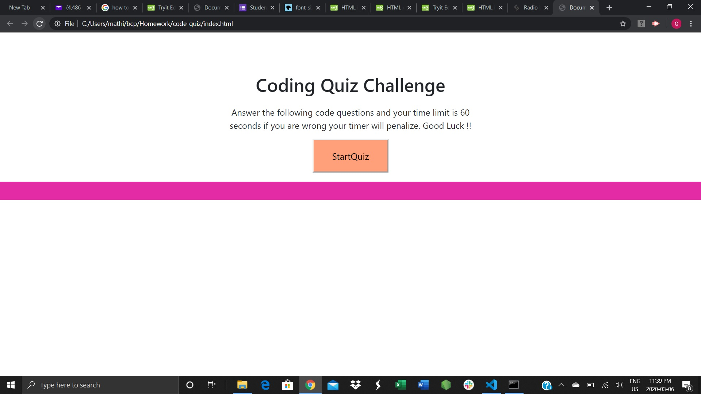
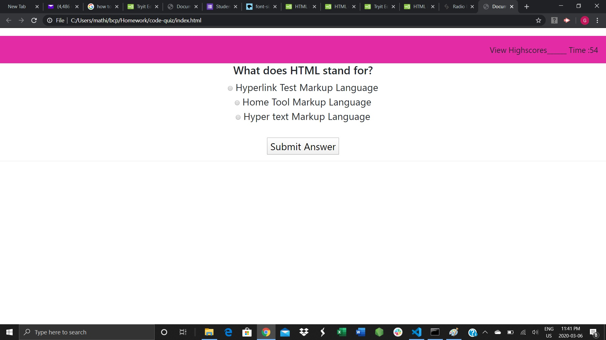
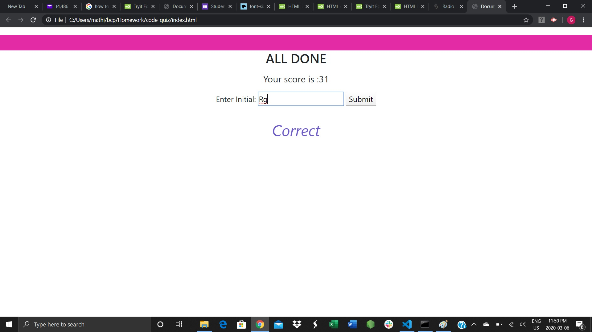
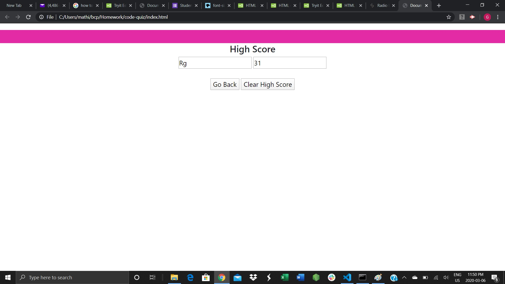

# code-quiz

# This Quiz based web site show the set of question and choices one after another.

# Timer interval will start at the begining of the session

# If the quiz answer is not correct then the timer session will be decreased

# Once the quiz is over the remaining time will display as result and intializer input will be received

# Incase, if the the timer is over before quiz completed then quiz will stop and show the alert message 

# Final result with initial will be shown.

# 
# 
# 
# 
